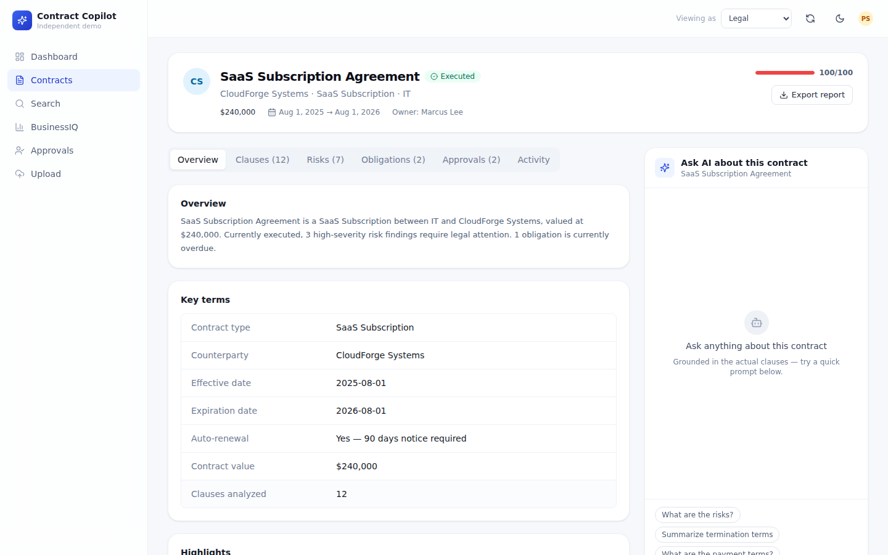
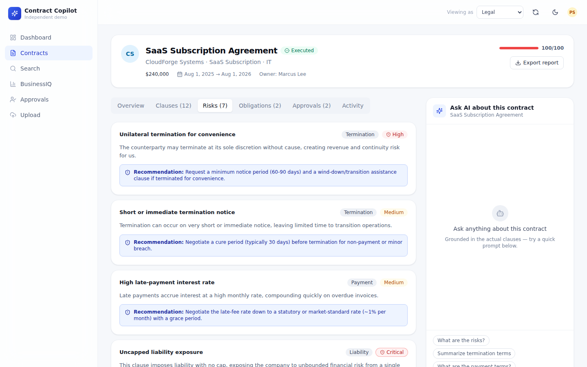
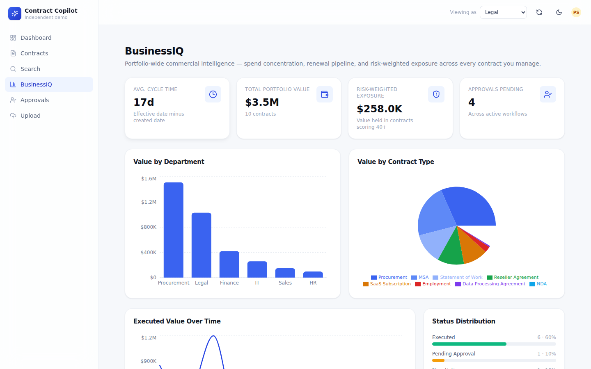
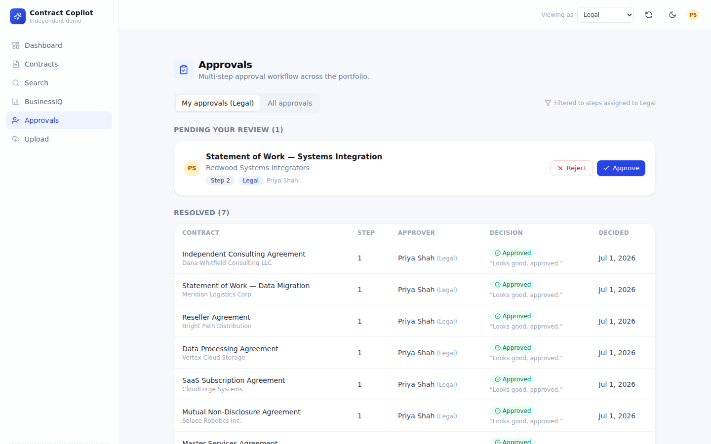

# Contract Intelligence Copilot

**An independent, AI-powered Contract Lifecycle Management (CLM) portfolio demo.**

> Built as an internship-portfolio project inspired by the public CLM product category (Malbek, Ironclad, Icertis,
> DocuSign CLM, Conga, Agiloft, Sirion, LinkSquares, SpotDraft, and others). **This project is not affiliated with,
> endorsed by, or built in partnership with Malbek Inc. or any other CLM vendor.** No proprietary code, data, or
> branding from any vendor was used — all sample contracts, UI, and code are original.

---

## What this is

A real, working CLM application — not a static mockup. Upload a contract (PDF/DOCX/TXT) or pick from ten pre-loaded
sample agreements, and the app will:

- Segment and classify every clause into 14 legal categories
- Flag risky language (uncapped liability, one-sided indemnification, auto-renewal traps, broad non-competes, missing
  breach-notification language, and more) with a plain-English recommendation for each
- Extract obligations (payments, renewal notices, reporting, audits, insurance, deliverables) with due dates and
  live overdue/due-soon/upcoming status
- Diff any two versions of a contract word-by-word (built for amendment tracking)
- Simulate a multi-step approval workflow (Legal → Finance → Executive)
- Roll a whole portfolio up into a "BusinessIQ"-style commercial-intelligence dashboard
- Answer natural-language questions about a specific contract, citing the actual clauses it used
- Search across the entire contract repository by relevance, not just exact string match
- Export a clean, board-ready executive report per contract

All of this works **immediately, offline, with zero API keys** — the analysis engine is a deterministic, rule-based
"mock AI" (regex/keyword clause classification, heuristic risk detection, date-aware obligation extraction, and
retrieval-based chat). It is a genuine implementation, not canned responses — see
[`src/lib/ai/mock/`](src/lib/ai/mock/). A clean provider interface (see [`src/lib/ai/provider.ts`](src/lib/ai/provider.ts))
lets you swap in real Anthropic Claude or OpenAI calls with one environment variable — see
[Plugging in a real LLM](#plugging-in-a-real-llm) below.

---

## Quick start

Requires Node.js 20+.

```bash
npm install
npm run db:seed     # creates ./data/clm.db (SQLite) and loads 10 sample contracts
npm run dev         # http://localhost:3000
```

Open the site, click **Enter the demo**, and explore. Use **Reset demo data** in the top bar at any time to restore
the original sample dataset (handy after playing with uploads or approvals).

No `.env` file is required to run the demo. See [`.env.example`](.env.example) for optional configuration.

---

## Screenshots

| | |
|---|---|
|  |  |
|  |  |
|  |  |

More in [`public/screenshots/`](public/screenshots/). Regenerate anytime with `node scripts/capture-screenshots.mjs`
while the app is running (uses Playwright).

---

## Tech stack

| Layer | Choice | Why |
|---|---|---|
| Framework | Next.js 14 (App Router, React Server Components) | Fast, modern, industry-standard; server components let pages read SQLite directly with zero client-side data-fetching boilerplate |
| Language | TypeScript, `strict: true` | Type safety across the whole data model, from DB rows to UI props |
| Styling | Tailwind CSS v3 + hand-built component library (`src/components/ui/`) | Full control over a premium, consistent design system without a heavyweight UI framework dependency |
| Animation | Framer Motion | Subtle, tasteful entrance/hover polish |
| Database | SQLite via `better-sqlite3` | Zero-config, zero-external-services, synchronous (simple, no ORM ceremony); see [Known limitations](#known-limitations) for the Postgres upgrade path |
| Parsing | `pdf-parse`, `mammoth` | Real PDF and DOCX text extraction |
| Diffing | `diff` | Real word-level version comparison |
| Search | Hand-rolled TF-IDF + cosine similarity (`src/lib/text-search.ts`) | Real relevance ranking with zero external vector-DB dependency |
| Charts | Recharts | Portfolio and BusinessIQ visualizations |
| Testing | Vitest (unit) + Playwright (e2e) | See [Testing](#testing) |

---

## Project structure

```
src/
  app/
    page.tsx                    marketing landing page
    (app)/                      main app, wrapped in sidebar + topbar
      dashboard/                portfolio command center
      contracts/                repository list, detail, and version-diff view
      insights/                 "BusinessIQ" commercial-intelligence dashboard
      approvals/                approval workflow queue
      upload/                   contract ingestion (file or pasted text)
      search/                   cross-repository search
    api/                        route handlers (chat, approvals, export, upload, demo reset)
  components/
    ui/                         hand-built design system primitives (Button, Card, Table, Tabs, ...)
    layout/                     sidebar, topbar, mobile nav, app shell
    contracts/                  contract-specific UI (badges, chat panel, tabs)
    dashboard/ insights/ landing/  page-specific components
  data/
    sample-contracts/           10 original, realistic sample contracts (plain text)
    manifest.ts                 seed metadata for each sample contract
  lib/
    types.ts                    the whole domain model
    db/                         SQLite schema + typed repository layer
    ai/                         the analysis-engine abstraction + deterministic mock engine + LLM provider stubs
    ingest.ts                   turns raw text into a persisted contract (clauses, risks, obligations)
    insights.ts                 portfolio-wide aggregation for the dashboard/BusinessIQ
    search.ts                   cross-repository relevance search
    text-search.ts              TF-IDF vectorization + cosine similarity
    validation.ts                zod schemas for all API inputs
scripts/
  seed.ts  reset.ts             CLI wrappers around src/lib/seed.ts
tests/
  unit/                         Vitest unit tests (36 tests, pure-function coverage of the AI engine)
  e2e/                          Playwright end-to-end smoke tests
docs/
  research/                     Malbek + CLM market research report
  product/                      vision, PRD, personas, journeys, roadmap, demo script
  architecture/                 system design, security model, data model, API spec
  testing/                      test summary / quality-gate report
  pitch/                        CEO pitch message template
```

---

## Plugging in a real LLM

The mock engine is the default and requires nothing. To use a real model instead:

```bash
cp .env.example .env.local
```

Then set:

```bash
AI_PROVIDER=anthropic
ANTHROPIC_API_KEY=sk-ant-...
# or
AI_PROVIDER=openai
OPENAI_API_KEY=sk-...
# OpenAI-compatible gateways (e.g. OpenRouter) work too via OPENAI_BASE_URL
```

The factory in [`src/lib/ai/index.ts`](src/lib/ai/index.ts) picks the engine at runtime; every call site
(`ingestContract`, the chat API route) is written against the shared `AnalysisEngine` interface, so nothing else in
the app needs to change. **No API key is committed anywhere in this repository.**

---

## Testing

```bash
npm run typecheck   # tsc --noEmit, strict mode, zero errors
npm run lint         # eslint (next/core-web-vitals + next/typescript)
npm test             # vitest — 36 unit tests covering clause segmentation, classification,
                      # risk heuristics, obligation extraction, text search, and the end-to-end
                      # mock-engine ingestion pipeline
npm run test:e2e     # playwright — smoke tests for the full demo flow (see tests/e2e/)
```

See [`docs/testing/test-summary.md`](docs/testing/test-summary.md) for the full test report.

---

## Known limitations

- **SQLite is file-based**, so this demo is built for local/single-instance use. Swapping to Postgres/Supabase is a
  contained change (see `docs/architecture/system-design.md` for the upgrade path) — the repository layer already
  isolates all SQL behind `src/lib/db/repo.ts`.
- **No real authentication.** The role switcher in the top bar is a lightweight, client-side demo affordance, not an
  access-control system. See `docs/architecture/security-model.md` for what real enterprise auth (SSO/SAML, RBAC,
  audit logging) would require.
- **The mock AI engine is rule-based, not a language model.** It is genuinely functional (see the test suite), but it
  will miss nuance a real LLM would catch. It exists so the whole app works instantly, offline, for free — and to
  prove the extraction logic is real and inspectable rather than a black box.
- **Version diffing compares two stored versions**, not a live redline/track-changes editor.
- See `docs/product/feature-roadmap.md` for the "Next" and "Later" roadmap.

---

## Scripts

| Command | Purpose |
|---|---|
| `npm run dev` | start the dev server |
| `npm run build` / `npm start` | production build/serve |
| `npm run db:seed` | wipe and reload the 10 sample contracts |
| `npm run db:reset` | wipe all data (no reseed) |
| `npm run typecheck` | TypeScript strict check |
| `npm run lint` | ESLint |
| `npm test` | Vitest unit tests |
| `npm run test:e2e` | Playwright end-to-end tests |

---

## License / usage

This is a personal portfolio project shared for demonstration purposes. Sample contract text is original and
fictional. Do not use it as legal advice or as a template for real contracts.
