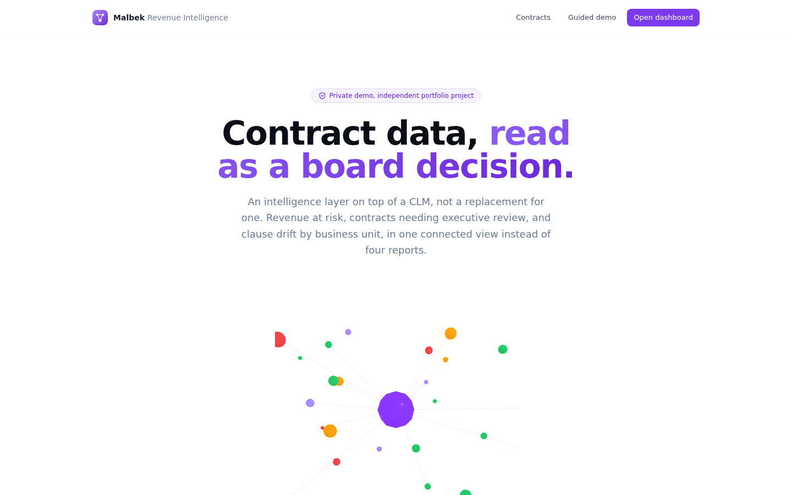
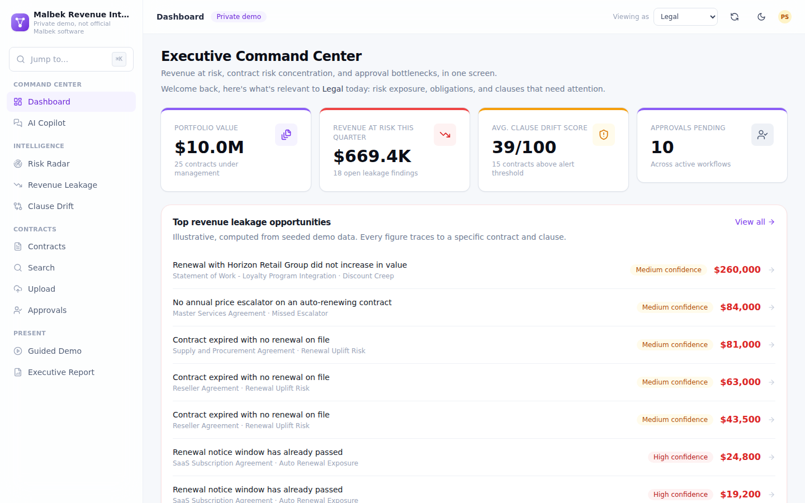
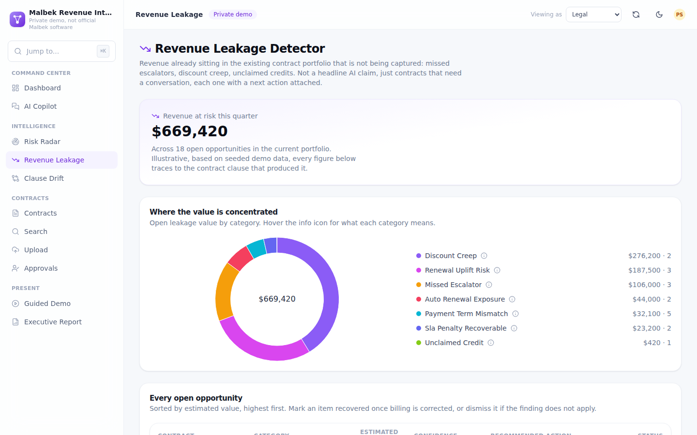
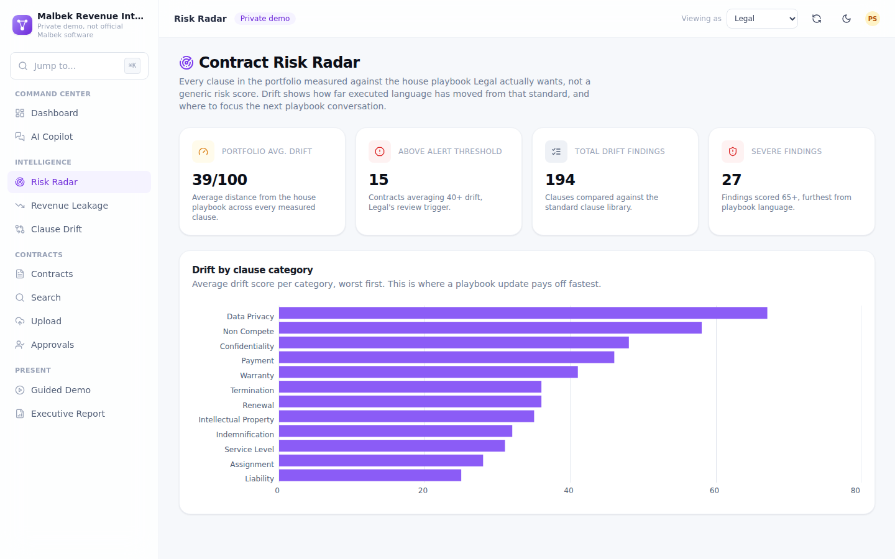
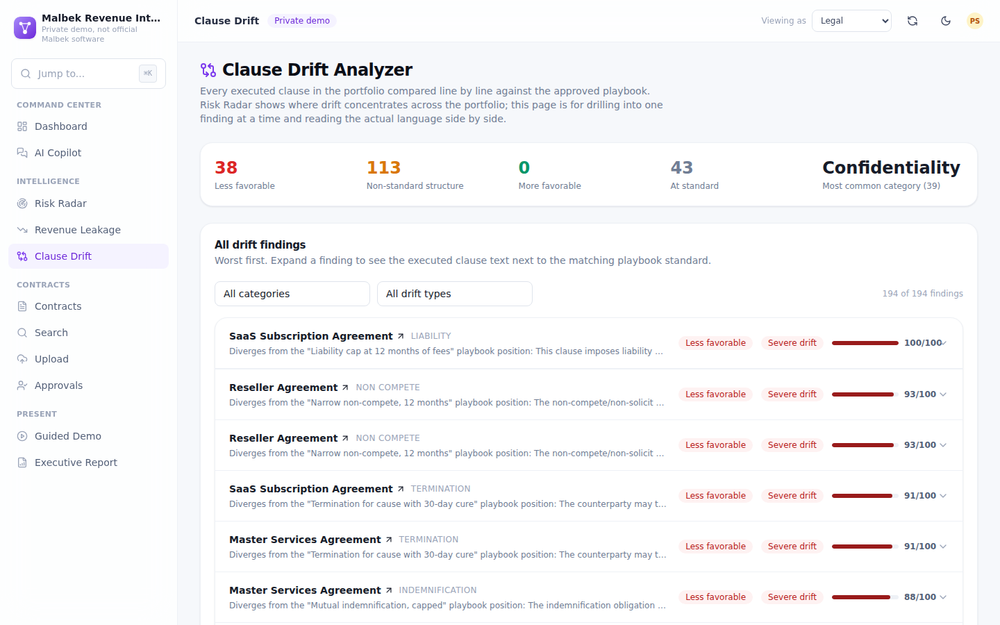
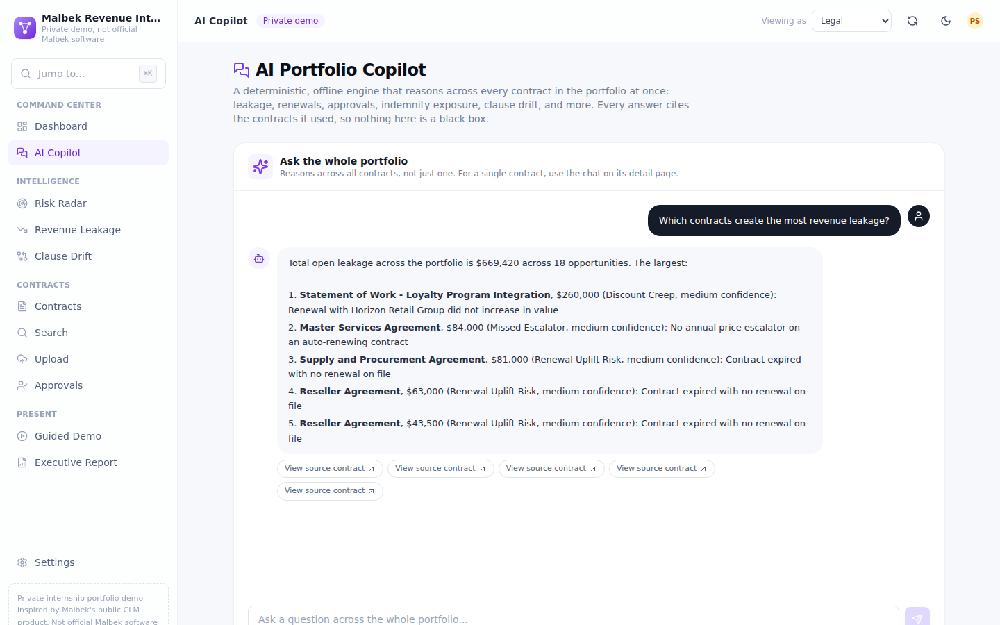

# Malbek Revenue Intelligence and Contract Risk Command Center

**An independent, AI-powered contract portfolio intelligence demo, inspired by Malbek's public CLM product space.**

> Built as an internship-portfolio project. Used with informal permission to reference Malbek's name and brand
> colors inside this private demo only. **This project is not affiliated with, endorsed by, or built in partnership
> with Malbek Inc.** No proprietary code, data, or branding from Malbek or any other vendor was used; all sample
> contracts, UI, and code are original. Not for public release.

---

## What this is

A real, working portfolio-intelligence layer on top of a CLM, not a static mockup and not a Malbek clone. It sits
on twenty-five seeded contracts across sixteen counterparties and, entirely offline with zero API keys, it:

- **Detects revenue leakage.** Missed price escalators, renewals that passed their notice window, payment-term
  mismatches, unclaimed SLA credits, and discount creep across renewals, each finding traced to a specific clause
  and contract, not a guess.
- **Scores contract risk against a house playbook.** Every executed clause is compared to a standard-clause library
  by category, producing a drift score instead of a generic severity label.
- **Analyzes clause drift.** Executed language shown side by side with the matching playbook standard, so Legal can
  see exactly how a clause diverged and where to fix it.
- **Answers portfolio-wide questions.** A natural-language copilot grounded in the real clause library, citing the
  contracts it used for every answer.
- **Rolls it all into role-based command centers** for Legal, Sales, Finance, Procurement, and Executive views, an
  approval workflow, version diffing, cross-repository search, and a live, exportable board report.

All of this works **immediately, offline, with zero API keys**: the analysis engine is a deterministic, rule-based
system (regex/keyword clause classification, heuristic risk detection, date-aware obligation extraction, TF-IDF
relevance search, and rule-based leakage and drift detection). It is a genuine implementation, not canned responses;
see [`src/lib/ai/mock/`](src/lib/ai/mock/), [`src/lib/revenue/`](src/lib/revenue/), and
[`src/lib/risk/`](src/lib/risk/). A clean provider interface (see [`src/lib/ai/provider.ts`](src/lib/ai/provider.ts))
lets you swap in real Anthropic Claude or OpenAI calls with one environment variable; see
[Plugging in a real LLM](#plugging-in-a-real-llm) below.

---

## Screenshots

| | |
|---|---|
|  |  |
|  |  |
|  |  |

More in [`public/screenshots/`](public/screenshots/). Regenerate anytime with `node scripts/smoke-drive-v2.mjs`
while the app is running on port 3100 (uses Playwright).

---

## Quick start

Requires Node.js 20+.

```bash
npm install
npm run db:seed     # creates ./data/clm.db (SQLite) and loads 25 sample contracts
npm run dev          # http://localhost:3000
```

Open the site and click **Open the dashboard**, or **Take the guided demo** for a seven-step walkthrough with live
numbers and presenter notes at `/demo`. Use **Reset demo data** in the top bar at any time to restore the original
seeded dataset (handy after playing with uploads or approvals).

No `.env` file is required to run the demo. See [`.env.example`](.env.example) for optional configuration.

---

## Deploying

The app deploys to Vercel with zero configuration:

1. Push this repo to GitHub (already done if you're reading this on GitHub).
2. Go to [vercel.com/new](https://vercel.com/new), import the repo, and click **Deploy**. No environment variables
   are required for the default mock engine.

**How the data layer works on Vercel:** the app uses SQLite (`better-sqlite3`), which needs a writable file. Vercel's
deployment bundle is read-only except for `/tmp`, so `src/lib/db/index.ts` detects the `VERCEL` environment variable
(set automatically by the platform) and points the database at `/tmp/data/clm.db` there instead of the project
folder. The root layout calls `ensureSeeded()` on every request, which is a cheap no-op once the 25 sample contracts
are loaded, so the first request to a cold serverless instance seeds itself automatically; no manual seed step is
needed after deploying.

The tradeoff: `/tmp` is ephemeral per serverless instance, not a shared persistent disk. Within one warm instance
(what a single visitor clicks through in one session), everything, including uploads, approvals, and marking
leakage findings recovered, works and persists normally. Across cold starts or different instances, it resets back
to the clean 25-contract seed. For a click-through portfolio demo this is a feature, not a bug: the link always
opens clean. For a version with a real shared database, point `DATA_DIR` at a hosted Postgres/Turso/LibSQL instance
instead, or deploy to a platform with a persistent disk (Railway, Render, Fly.io) where the unmodified local-file
behavior just works.

---

## Routes

| Route | What it shows |
|---|---|
| `/` | Landing page with a live portfolio snapshot |
| `/dashboard` | Executive Command Center: portfolio KPIs, top leakage, risk distribution, renewals, bottlenecks |
| `/risk-radar` | Contract Risk Radar: clause drift scored against the house playbook, by category and contract |
| `/revenue-leakage` | Revenue Leakage Detector: every open leakage finding, sortable, with a status workflow |
| `/clause-drift` | Clause Drift Analyzer: every clause finding, filterable, executed text next to playbook text |
| `/copilot` | AI Portfolio Copilot: portfolio-wide natural-language Q&A with citations |
| `/contracts`, `/contracts/[id]` | Contract repository, detail pages, and version comparison |
| `/approvals` | Multi-step approval workflow queue |
| `/upload` | Contract ingestion from a file (PDF/DOCX/TXT) or pasted text |
| `/search` | Cross-repository relevance search |
| `/demo` | Guided, seven-step walkthrough with live numbers and presenter notes |
| `/report` | Live executive report preview and export (portfolio or single-contract) |
| `/settings` | Role view switcher, analysis-engine status, and demo-data reset |

---

## Tech stack

| Layer | Choice | Why |
|---|---|---|
| Framework | Next.js 14 (App Router, React Server Components) | Fast, modern, industry-standard; server components let pages read SQLite directly with zero client-side data-fetching boilerplate |
| Language | TypeScript, `strict: true` | Type safety across the whole data model, from DB rows to UI props |
| Styling | Tailwind CSS v3 + hand-built component library (`src/components/ui/`), backed by Radix UI primitives | Full control over a premium, consistent design system, with accessible composable primitives where it matters (dialogs, dropdowns, tooltips, accordions, command palette) |
| Charts | Tremor (`@tremor/react`) | Enterprise-grade metric cards, bar/donut charts for the intelligence modules |
| 3D | react-three-fiber, drei, postprocessing | One tasteful hero visual (the risk constellation on the landing page), lazy-loaded and reduced-motion aware |
| Animation | Framer Motion | Subtle, tasteful entrance/hover polish and page transitions |
| Database | SQLite via `better-sqlite3` | Zero-config, zero-external-services, synchronous (simple, no ORM ceremony); see [Known limitations](#known-limitations) for the Postgres upgrade path |
| Parsing | `pdf-parse`, `mammoth` | Real PDF and DOCX text extraction |
| Diffing | `diff` | Real word-level version comparison |
| Search | Hand-rolled TF-IDF + cosine similarity (`src/lib/text-search.ts`) | Real relevance ranking with zero external vector-DB dependency; reused for clause-drift similarity scoring |
| Command palette | cmdk | Cmd+K navigation across every route |
| Testing | Vitest (unit) + Playwright (e2e) | See [Testing](#testing) |

---

## Project structure

```
src/
  app/
    page.tsx                    marketing landing page with the 3D risk-constellation hero
    (app)/                      main app, wrapped in sidebar + topbar
      dashboard/                Executive Command Center
      risk-radar/               Contract Risk Radar
      revenue-leakage/          Revenue Leakage Detector
      clause-drift/             Clause Drift Analyzer
      copilot/                  AI Portfolio Copilot (portfolio-wide chat)
      demo/                     guided, seven-step walkthrough
      report/                   live executive report preview and export
      settings/                 role view, analysis-engine status, demo-data reset
      contracts/                repository list, detail, and version-diff view
      approvals/                approval workflow queue
      upload/                   contract ingestion (file or pasted text)
      search/                   cross-repository search
      insights/                 redirects to /dashboard (v0.1 BusinessIQ logic now folded in)
    api/                        route handlers (chat, copilot, approvals, leakage status, export, report, upload, demo reset)
  components/
    ui/                         hand-built design system primitives, Radix-backed where composability matters
    layout/                     sidebar, topbar, mobile nav, command palette, app shell
    three/                      the risk-constellation 3D scene and its reduced-motion-aware wrapper
    dashboard/ risk/ revenue/ copilot/ demo/ reporting/ settings/  page-specific components
  data/
    sample-contracts/           25 original, realistic sample contracts (plain text)
    manifest.ts                 seed metadata for each sample contract
  lib/
    types.ts                    the whole domain model
    db/                         SQLite schema + typed repository layer
    ai/                         the analysis-engine abstraction, deterministic mock engine, portfolio copilot, LLM provider stubs
    risk/                       standard-clause library, clause-drift scoring, risk-radar aggregation
    revenue/                    leakage detection rules (per-contract and cross-contract), revenue-intelligence aggregation
    reporting/                  negotiation-brief generation
    ingest.ts                   turns raw text into a persisted contract (clauses, risks, obligations, leakage, drift)
    insights.ts                 portfolio-wide aggregation, reused by the new dashboard
    search.ts                   cross-repository relevance search
    text-search.ts              TF-IDF vectorization + cosine similarity
    validation.ts               zod schemas for all API inputs
scripts/
  seed.ts  reset.ts             CLI wrappers around src/lib/seed.ts
tests/
  unit/                         Vitest unit tests (71 tests: AI engine, leakage rules, clause drift, portfolio copilot)
  e2e/                          Playwright end-to-end tests (18 tests across the full v1 and v2 route surface)
docs/
  research/                     Malbek + CLM market research, plus the v2 upgrade research
  product/                      vision, PRD, personas, journeys, roadmap, upgrade PRD, value proposition, feature prioritization
  design/                       design direction and visual benchmark
  architecture/                 system design, security model, data model, API spec, upgrade plan, quality plan
  audits/                       the pre-v2 honest audit of the v0.1 demo
  demo/                         the current CEO demo script and outreach pitch message
  testing/                      test summary / quality-gate report
  pitch/                        v0.1 pitch message (superseded, kept for history)
```

---

## Plugging in a real LLM

The mock engine is the default and requires nothing. To use a real model instead:

```bash
cp .env.example .env.local
```

Then set:

```bash
AI_PROVIDER=anthropic
ANTHROPIC_API_KEY=sk-ant-...
# or
AI_PROVIDER=openai
OPENAI_API_KEY=sk-...
# OpenAI-compatible gateways (e.g. OpenRouter) work too via OPENAI_BASE_URL
```

The factory in [`src/lib/ai/index.ts`](src/lib/ai/index.ts) picks the engine at runtime; every call site
(`ingestContract`, the per-contract chat API route) is written against the shared `AnalysisEngine` interface, so
nothing else in the app needs to change. The portfolio copilot (`/copilot`) is deliberately kept on the local,
deterministic engine regardless of provider, since it answers from structured leakage/drift data rather than
free-form generation. **No API key is committed anywhere in this repository.**

---

## Testing

```bash
npm run typecheck   # tsc --noEmit, strict mode, zero errors
npm run lint         # eslint (next/core-web-vitals + next/typescript)
npm test             # vitest - 71 unit tests covering clause segmentation, classification,
                      # risk heuristics, obligation extraction, text search, leakage detection,
                      # clause drift scoring, the portfolio copilot, and the mock-engine
                      # ingestion pipeline end to end
npm run test:e2e     # playwright - 18 end-to-end tests across the full demo path, including
                      # every v2 route (see tests/e2e/)
```

See [`docs/testing/test-summary.md`](docs/testing/test-summary.md) for the full test report.

---

## Known limitations

- **SQLite is file-based**, so this demo is built for local/single-instance use. On Vercel this means the database
  lives in ephemeral `/tmp` and resets on cold start; see [Deploying](#deploying) above for the full explanation.
  Swapping to Postgres/Supabase is a contained change (see `docs/architecture/system-design.md` for the upgrade
  path); the repository layer already isolates all SQL behind `src/lib/db/repo.ts`.
- **No real authentication.** The role switcher in the top bar is a lightweight, client-side demo affordance, not an
  access-control system. See `docs/architecture/security-model.md` for what real enterprise auth (SSO/SAML, RBAC,
  audit logging) would require.
- **The mock AI engine is rule-based, not a language model.** It is genuinely functional (see the test suite), but
  it will miss nuance a real LLM would catch. It exists so the whole app works instantly, offline, for free, and to
  prove the extraction and detection logic is real and inspectable rather than a black box.
- **Leakage and drift detection are heuristic, not audited financial calculations.** The dollar figures are
  illustrative, computed consistently from seeded contract data; every figure traces to a specific contract and
  clause, but they should not be read as a real financial recovery estimate.
- **Version diffing compares two stored versions**, not a live redline/track-changes editor.
- **Brand colors are an informed approximation**, not verified against official Malbek brand guidelines; see
  `docs/design/design-direction.md`.
- See `docs/product/feature-roadmap.md` for the "Next" and "Later" roadmap.

---

## Scripts

| Command | Purpose |
|---|---|
| `npm run dev` | start the dev server |
| `npm run build` / `npm start` | production build/serve |
| `npm run db:seed` | wipe and reload the 25 sample contracts |
| `npm run db:reset` | wipe all data (no reseed) |
| `npm run typecheck` | TypeScript strict check |
| `npm run lint` | ESLint |
| `npm test` | Vitest unit tests |
| `npm run test:e2e` | Playwright end-to-end tests |

---

## License / usage

This is a personal portfolio project shared for demonstration purposes. Sample contract text is original and
fictional. Do not use it as legal advice or as a template for real contracts.
